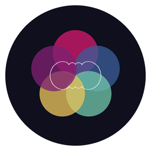
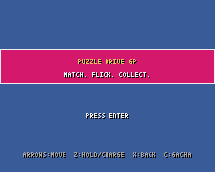
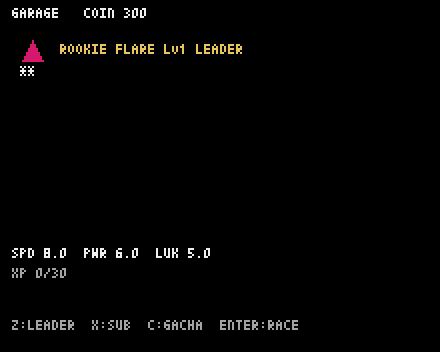
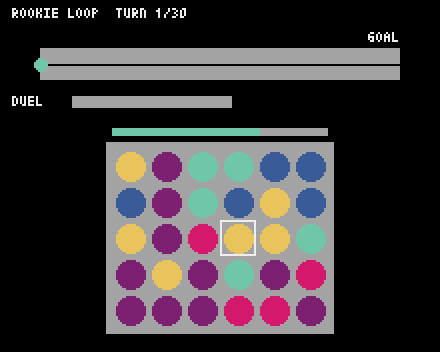
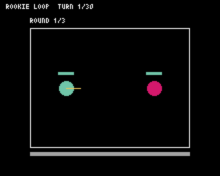

<p align="center">
  
</p>

<h1 align="center">Puzzle Drive GP</h1>

<p align="center">
  A turn-based racing game built with <a href="https://github.com/kitao/pyxel">Pyxel</a>, running entirely as WebAssembly in the browser — no server, no build step.
</p>

<p align="center">
  
  
  
</p>

Match orbs to move your driver along the board, flick-battle rivals who catch up to you, and spend race winnings on a gacha to grow your roster.

## How to play

**1. Garage — build your team.**
Pick one **Leader** (the driver who actually races — their color and stats drive everything below) and up to two **Subs**, who don't race directly but add a passive stat bonus to your Leader. Press `Z` on a driver to make them Leader, `X` to toggle them as a Sub.

**2. Gacha — grow your roster.**
Spend coins earned from racing to pull a random driver (1★–5★ rarity). New pulls are added straight to your Garage roster.

**3. Race Select — pick a course.**
Three courses of increasing length and rival strength: Rookie Loop (20 tiles), Circuit Rush (24 tiles), Champion Track (28 tiles). You race against 3 CPU rivals over up to 30 turns.

**4. Race — the turn loop.**
Each turn has two parts:

- **Puzzle phase**: a 6×5 grid of 5 colored orbs appears. Move the cursor with the arrow keys, hold `Z` and press an arrow to pick up the orb under the cursor and drag it through the grid (it swaps with whatever it passes over), then release `Z` to drop it. You have 5 seconds. Matching 3+ same-colored orbs in a row/column clears them — remaining orbs fall and the grid refills, so one good drag can chain into a multi-step combo.
- **What each color does** depends on your Leader's own color: matching your **Leader's color** advances your driver along the board (bigger groups and combos move you further); the *next* color in the wheel charges your **duel gauge**; the one after that earns bonus **coins**; the remaining two give a small flat advance. The in-race HUD's color order always follows this rule, so it's worth noting your Leader's color before you start dragging orbs.
- CPU rivals advance automatically each turn based on their own stats — no puzzle for them.
- If you end a turn within 3 tiles of a rival, a **duel** breaks out (see below). Reaching the goal tile — or turn 30, whichever comes first — ends the race.

**5. Duel — flick battle.**
You and the rival each get a token in a small arena. Hold `Left`/`Right` to aim, hold `Z` to charge power, release to launch your token like a billiard ball — it bounces off the walls and, on impact, knocks the rival back and deals damage based on impact speed. Best of 3 rounds; the winner advances on the board and the loser is knocked back and stunned for their next puzzle turn.

**6. Result.**
Your finishing position pays out coins and XP for your Leader (and half that XP for your Subs), then it's back to the Garage to spend, level up, and race again.

## Play

Open `index.html` through a local web server (required — `pyxel-run` fetches the `.py` files over HTTP, so `file://` won't work):

```sh
python3 -m http.server 8000
```

Then visit `http://localhost:8000/`.

Deploying to GitHub Pages works the same way: push this repo and enable Pages on the branch root, no build step needed.

## Controls

| Screen | Keys |
|---|---|
| Menus | Arrows: navigate · Z / Enter: confirm · X: back · C: gacha (from Garage) |
| Puzzle | Arrows: move cursor · hold Z + arrows: drag an orb · release Z: drop |
| Duel | Hold Left/Right: aim · hold Z: charge · release Z: launch |

## Screenshots

| | |
|---|---|
|  |  |
|  |  |

## How it's built

Every visual and audio asset is generated by a Python script — there are no image or sound files loaded into the game itself:

- **In-game graphics** (drivers, orbs, arenas, UI) are drawn at runtime with Pyxel's primitive shapes (`rect`, `circ`, `tri`, ...).
- **In-game music and sound effects** are synthesized procedurally with `pyxel.sounds` / `pyxel.musics`; the background melody is generated from a small sum of sine waves (a Fourier-style additive construction) rather than hand-written notes.
- **The icon and favicon** (`tools/make_icon.py`, `tools/mathart.py`) are drawn with Pillow using the same kind of math: Fourier epicycles swept into a five-petal mandala, one petal per orb color.

Progress (owned drivers, currency, levels) lives in memory for the current browser session only — there's no persistence across page reloads.

## Project layout

```
index.html            entry page: loads the Pyxel web runtime, points it at src/main.py
src/                   game source, fetched directly by the browser at runtime
  main.py, app.py         bootstrap and top-level screen state machine
  constants.py, sound.py  tunables and procedural audio
  puzzle.py, duel.py, board.py, rival.py, race.py   race turn loop
  driver.py, roster_data.py, gacha.py, player_profile.py   collection & growth
  garage.py, gacha_screen.py, race_select.py   menu screens
tools/                 local, dev-time only — not fetched by the browser
  mathart.py, make_icon.py   generative art for the icon/favicon
assets/                generated output (icon.png, favicon.png)
screenshots/           images used in this README
```
