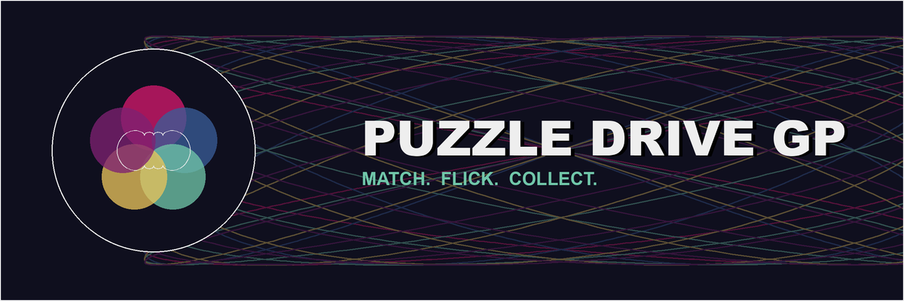

# PUZZLE DRIVE GP



A turn-based racing game for the browser, built with [Pyxel](https://github.com/kitao/pyxel) and running entirely as WebAssembly — no build step, no server, just static files.

Match orbs to move your driver along the board, flick-battle rivals who catch up to you, and spend race winnings on a gacha to grow your roster.

## Play

Open `index.html` through a local web server (required — `pyxel-run` fetches the `.py` files over HTTP, so `file://` won't work):

```sh
python3 -m http.server 8000
```

Then visit `http://localhost:8000/`.

Deploying to GitHub Pages works the same way: push this directory and enable Pages on the branch root, no build step needed.

## Controls

| Screen | Keys |
|---|---|
| Menus | Arrows: navigate · Z / Enter: confirm · X: back · C: gacha (from Garage) |
| Puzzle | Arrows: move cursor · hold Z + arrows: drag an orb · release Z: drop |
| Duel | Hold Left/Right: aim · hold Z: charge · release Z: launch |

## Screenshots

| | |
|---|---|
|  |  |
|  |  |

## How it's built

Every visual and audio asset is generated by a Python script — there are no image or sound files loaded into the game itself:

- **In-game graphics** (drivers, orbs, arenas, UI) are drawn at runtime with Pyxel's primitive shapes (`rect`, `circ`, `tri`, ...).
- **In-game music and sound effects** are synthesized procedurally with `pyxel.sounds` / `pyxel.musics`; the background melody is generated from a small sum of sine waves (a Fourier-style additive construction) rather than hand-written notes.
- **Icon, favicon, and this README's banner** (`make_icon.py`, `make_banner.py`, `mathart.py`) are drawn with Pillow using the same kind of math: Fourier epicycles and Lissajous curves.

Progress (owned drivers, currency, levels) lives in memory for the current browser session only — there's no persistence across page reloads.

## Project layout

```
main.py, app.py            bootstrap and top-level screen state machine
constants.py, sound.py     tunables and procedural audio
puzzle.py, duel.py, board.py, rival.py, race.py   race turn loop
driver.py, roster_data.py, gacha.py, player_profile.py   collection & growth
garage.py, gacha_screen.py, race_select.py   menu screens
mathart.py, make_icon.py, make_banner.py   generative art for icon/banner
```
